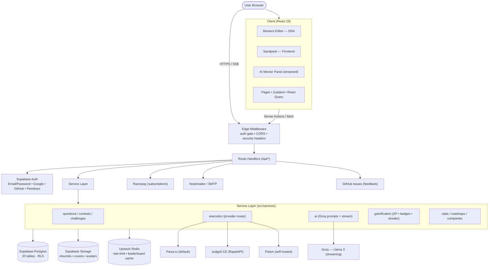
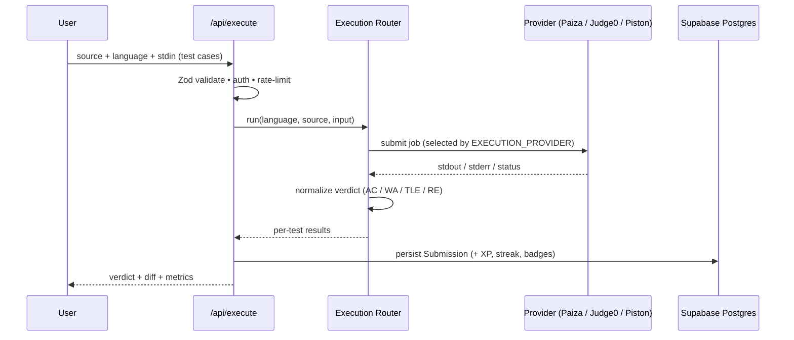

<div align="center">


# CodeForge AI

### Your AI-powered coding interview prep workspace

LeetCode-style DSA problems · An **instant online compiler** · Frontend sandbox challenges · Live contests · Personalized roadmaps · Spaced-repetition revision · A community forum · Local mock interviews · A real-time streaming **AI Mentor** — all in one cohesive developer workspace.

<br/>

[](https://codeforgeai.io/changelog)
[](https://nextjs.org/)
[](https://react.dev/)
[](https://www.typescriptlang.org/)
[](https://tailwindcss.com/)
[](https://supabase.com/)
[](https://webauthn.io/)
[](https://upstash.com/)
[](https://groq.com/)
<br/>
[](https://zustand.docs.pmnd.rs/)
[](https://tanstack.com/query/latest)
[](https://posthog.com/)
[](https://opentelemetry.io/)
[](https://jestjs.io/)
[](https://playwright.dev/)
[](https://swagger.io/)
[](https://opensource.org/licenses/MIT)

<a href="#-getting-started"><b>Getting Started</b></a> ·
<a href="#-core-features"><b>Features</b></a> ·
<a href="#-tech-stack"><b>Tech Stack</b></a> ·
<a href="#-changelog"><b>Changelog</b></a> ·
<a href="#-deployment"><b>Deployment</b></a>

<sub><a href="https://codeforgeai.io/about">About</a> · <a href="https://codeforgeai.io/contact">Contact</a> · <a href="https://codeforgeai.io/changelog">Changelog</a> · <a href="https://codeforgeai.io/privacy">Privacy</a> · <a href="https://codeforgeai.io/terms">Terms</a></sub>

</div>

---

## System Architecture

CodeForge AI is a **single Next.js 15 (App Router) application** that serves the UI, the API, and background work from one codebase. It follows a layered design — **route handlers → service layer → data/integration layer** — so that providers (code runners, AI, payments) are swappable behind interfaces and the app degrades gracefully when any optional integration is absent.

### High-Level Topology



### Request Lifecycle

1. **Edge middleware** ([src/middleware.ts](src/middleware.ts)) runs first on every request. It validates the **Supabase Auth** session (`getClaims`) against a public-route allowlist, enforces same-origin/CORS on mutating requests, and attaches security headers (CSP, HSTS, `X-Frame-Options: DENY`).
2. **Route handlers** under `src/app/api/*` validate input with **Zod**, resolve the session, and apply **rate limiting** (Upstash sliding window, with an in-memory fallback) before doing work.
3. **Service layer** (`src/services/*`) holds the business logic — question/contest queries, the execution-provider router, AI prompt orchestration, gamification, and stats — keeping handlers thin. Each data module reads/writes through a `backendFor()` flag, a legacy of the MongoDB→Supabase migration that still allows an instant rollback.
4. **Data & integrations** — **Supabase Postgres** persists state (33 tables, row-level security, service-role backend) and **Supabase Storage** holds uploads; Redis caches hot reads (leaderboards) and rate-limit counters; external providers (Groq, Razorpay, SMTP, GitHub, code runners) are called through small adapter modules in `src/lib` and `src/services`.

### Layer Responsibilities

| Layer            | Location                                               | Responsibility                                                                                      |
| :--------------- | :----------------------------------------------------- | :-------------------------------------------------------------------------------------------------- |
| **Client**       | `src/app/(platform)`, `src/features`, `src/components` | React 19 UI, Monaco/Sandpack workspaces, Zustand workspace store, React Query server-state cache    |
| **Edge**         | `src/middleware.ts`, `src/lib/supabase/middleware.ts`  | Supabase-Auth gating, CORS/origin guard, security headers, cookie policy                             |
| **API**          | `src/app/api/*`                                        | Route handlers: validation (Zod), authz (`lib/api-auth`), rate-limit, response shaping              |
| **Services**     | `src/services/*`                                       | Domain logic: questions, contests, execution, AI, gamification, stats, roadmaps + dual-backend stores |
| **Integrations** | `src/lib/*`                                            | `supabase/*`, `storage`, `webauthn`, `redis`, `mailer`, `github`, `site-config`, `rate-limit`, `openapi` |
| **Data**         | `supabase/migrations/*` (33 Postgres tables, RLS)      | Users, Questions, Submissions, Contests, Discussions, Subscriptions, SpacedRepetition, Badges, WebAuthn credentials, etc. |

### Code Execution Pipeline



The provider is chosen at runtime by `EXECUTION_PROVIDER`; all providers conform to one interface in `src/services/execution`, and outputs pass through a `normalize` step so verdicts are consistent regardless of backend. The standalone **Online Compiler** at `/api/compiler` reuses the same provider router — it executes a single program with optional stdin and returns raw stdout/stderr plus runtime and memory, skipping the test-case/verdict step.

### AI Mentor Pipeline

The AI panels post the **problem, code buffer, and runtime output** to streaming routes under `/api/ai/*`. The `ai` service composes a system prompt (progressive-hint policy) and forwards to **Groq (Llama 3)**, relaying tokens to the client over **Server-Sent Events** for real-time rendering. If `GROQ_API_KEY` is absent, the routes short-circuit and the UI shows inline setup guidance instead of failing.

### Resilience by Design

Every external dependency is optional and isolated, so a missing key degrades one feature rather than breaking the app: **no Redis** → in-memory rate-limit + on-demand leaderboard from Mongo; **no Groq** → AI panels show setup help; **no Razorpay** → billing hidden; **no SMTP/GitHub** → feedback and emails fall back or no-op; **DB unreachable at build** → `robots.txt`/`sitemap.xml` render dynamically rather than crashing the build.

---

## Core Features

<table>
<tr>
<td width="50%" valign="top">

### Hybrid Coding Workspaces

- **DSA Workspace** — Monaco editor with themes, font controls, **Vim** keybindings, Emmet, fullscreen, split-pane output, and auto-save (local + Supabase).
- **Online Compiler** (`/compiler`) — a blank-canvas editor that runs code in any of 12 languages with custom **stdin**, real stdout/stderr, and runtime + memory stats. No problem or test cases required.
- **Frontend Sandbox** — In-browser Sandpack for HTML/CSS, Vanilla JS, React & Tailwind with live hot-reload and a console emulator.
- **12 Languages** — JS, TS, Python, Java, C, C++, C#, Go, PHP, Rust, Kotlin, Swift.
- **Pluggable Engines** — Paiza, Judge0, or self-hosted Piston.

</td>
<td width="50%" valign="top">

### Live AI Mentor (Groq)

- **Context-Aware** — Understands the problem, your code buffer, and runtime output.
- **Progressive Hints** — Concept → algorithm → edge cases → optimization, never spoiling the answer.
- **Explain & Visualize** — "Why is this failing?" and time/space complexity, all streamed in real time.

</td>
</tr>
<tr>
<td width="50%" valign="top">

### AI Tools Suite (`/ai-tools`)

- **Learning Coach** — guidance tuned to your weak areas
- **Pair Programmer** — conversational coding help
- **Study Planner** — structured plans toward a date
- **Complexity Analyzer** — Big-O breakdowns
- **Code Review** — correctness, style & edge cases
- **Roadmap / Contest / Resume** generators
- **Project Review** — AI review of sandbox projects

</td>
<td width="50%" valign="top">

### Problems, Tracks & Roadmaps

- **Problem Bank** — filter by difficulty, tag & company.
- **Tracks & Roadmaps** — ordered, guided learning paths.
- **Company Prep** — Google, Meta, Amazon, Microsoft, Netflix, Uber & more.
- **Daily Plan** — a personalized daily study queue.

</td>
</tr>
<tr>
<td width="50%" valign="top">

### Revision & Memory

- **Spaced Repetition (SM-2)** — concepts resurface on an optimal schedule.
- **Revision Queue** — review due items in one flow.
- **Notes & Bookmarks** — per-problem notes and saved questions.

</td>
<td width="50%" valign="top">

### Analytics & Weakness Detection

- **Weakness Detection** — surfaces topics you struggle with most.
- **Personal Analytics** — progress charts, submission trends & accuracy (Recharts).

</td>
</tr>
<tr>
<td width="50%" valign="top">

### Gamification & Streaks

- **GitHub-style Heatmap** of daily activity.
- **XP & Levels** for correct, fast submissions.
- **Unlockable Badges** by category, streak & placement.

</td>
<td width="50%" valign="top">

### Contests & Leaderboards

- **Time-Penalty Scoring** on completion time & wrong attempts.
- **Real-time Standings** via Postgres aggregation, cached in Redis.
- **Daily Challenge** with double-XP rewards.

</td>
</tr>
<tr>
<td width="50%" valign="top">

### Mock Interviews

- **Simulated Sessions** with custom queues and strict timers.
- **Local Recording** of voice, video & workspace in-browser.
- **AI Feedback Report** on code cleanliness, debugging speed & approach.

</td>
<td width="50%" valign="top">

### Community & Social

- **Community Hub** (`/community`) — forum, discussions, leaderboard, recent threads & top members in one place.
- **Discussion Forum** (`/discuss`) — threaded solutions & doubts.
- **Follow System** & **Public Profiles** with a **custom avatar + cover photo**, badges, stats & heatmaps.
- **Feedback Channel** routed to admins.

</td>
</tr>
<tr>
<td width="50%" valign="top">

### Subscriptions & Billing

- **Razorpay** — order creation, verification & cancellation.
- **Free Trials** — Go Plan free for 30 days, no card.
- **Beta Program** — `/beta/join`, first **50** users get the Go Plan free.

</td>
<td width="50%" valign="top">

### Admin Dashboard (`/admin`)

- **Questions** — AI-generate, upload JSON, edit & publish.
- **Users** — inspect, manage subscriptions, promote admins.
- **Contests, Challenges, Prompt Templates & Site Settings.**
- **Analytics & Submissions** insights.

</td>
</tr>
</table>

> **Accounts, Auth & Settings** — **Supabase Auth** with email/password, Google & GitHub OAuth, and **passwordless passkeys** (Face ID / Touch ID / security keys). A guided onboarding flow, a working forgot/reset-password flow, and a comprehensive **7-tab Settings** hub: Profile (avatar + cover photo with a safe-zone guide), Account (linked methods + change password), Security (passkeys), Appearance (light/dark/system), Editor, Notifications, and Billing.
>
> **Docs & Transparency** — Browsable **OpenAPI/Swagger** docs at `/docs`, plus first-class Changelog, Pricing, Privacy & Terms pages.

---

## Tech Stack

| Layer | Technology / Packages | Purpose |
| :--- | :--- | :--- |
| **Framework** | Next.js 15.5 (App Router) | Core full-stack web framework (SSG/SSR, Server Actions, API routes) |
| **Language** | TypeScript 5 (Strict) | Compile-time type safety across client and server |
| **State Management** | Zustand 5 & React Query 5 | Client-side store & server-state caching/fetching |
| **Styling** | Tailwind CSS v4 & Framer Motion 12 | Zero-runtime styling, custom themes, and smooth micro-animations |
| **Database** | Supabase (Postgres) + `postgres.js` | Relational store — 33 tables with row-level security; a `backendFor()` flag keeps a Mongoose/MongoDB path for instant rollback |
| **File Storage** | Supabase Storage | Résumés, profile avatars and cover photos (served from public buckets) |
| **Cache & Rate-Limits** | Upstash Redis & Upstash Ratelimit 2 | Leaderboards caching, rate-limiting middleware |
| **Authentication** | Supabase Auth + `@supabase/ssr` · **Passkeys** (`@simplewebauthn`) · bcryptjs | Cookie sessions, email/password + Google/GitHub OAuth, passwordless passkey (WebAuthn) sign-in |
| **AI Mentoring** | Groq SDK (Llama 3) & LangSmith | Real-time streaming AI advice, model prompts, and evaluation/tracing |
| **Payments** | Razorpay SDK | Subscriptions, billing checkout, and order verification |
| **Editor / Sandbox** | Monaco Editor, Monaco Vim & Sandpack | DSA code editor (with Vim keys/Emmet) and client-side web sandbox |
| **Analytics & Telemetry** | PostHog & OpenTelemetry SDK | Product-use analytics, performance tracing, and application logging |
| **Form Handling** | React Hook Form & Zod | Client/server form validation and input schema sanitization |
| **API Documentation** | Swagger UI (`swagger-ui-dist`) | Interactive OpenAPI/Swagger documentation page at `/docs` |
| **Markdown Rendering** | React Markdown, rehype-sanitize & remark-gfm | Safe, sanitized GFM markdown rendering on client |
| **UI Components** | Radix UI primitives & Sonner | Headless, accessible UI elements and customizable toast notifications |
| **Email Delivery** | Nodemailer | Transactional emails (password-reset, beta confirmations) |
| **Data Viz / Icons** | Recharts & Font Awesome SVG | Dynamic analytics dashboards and consistent icon sets |

---

## Getting Started

### Prerequisites

- **Node.js** ≥ 18.x
- A **Supabase** project (the free tier is plenty)
- **Redis** _(optional — falls back to in-memory store)_
- **Groq API Key** _(optional — enables AI mentor & tools)_

### Installation

```bash
# 1. Install dependencies
npm install

# 2. Configure environment
cp .env.example .env.local
```

Set the **required** variables in `.env.local`:

```env
# Database connection
MONGODB_URI="mongodb+srv://..."

# Auth secret — generate with: openssl rand -base64 32
AUTH_SECRET="your-generated-auth-secret"
```

```bash
# 3. (optional) Seed starter questions
npm run seed

# 4. Start the dev server
npm run dev
```

Open **http://localhost:3000** to preview the app.

### Initial Run Checklist

1. **Become an admin** — add your email to `ADMIN_EMAILS`, then register at `/register`.
2. **Add questions** — in **Admin → Questions**: _Generate with AI_, _Upload JSON_, or run `npm run seed`.
3. **Publish** — flip the **Published** switch on questions to make them visible.
4. **Test run** — open a problem at `/problems`, pick a language, and **Run Code**.

> [!IMPORTANT]
> **Question I/O Contract** — Execution runs full programs reading **stdin** and writing **stdout**. A test case's `input` is the raw stdin stream and `expected` is the raw stdout stream. Keep this consistent when authoring or generating questions.

---

## Environment Reference

| Variable                            | Scope     | Status       | Purpose / Fallback                                                         |
| :---------------------------------- | :-------- | :----------- | :------------------------------------------------------------------------- |
| `NEXT_PUBLIC_SUPABASE_URL`          | Core      | **Required** | Supabase project URL (client + server).                                    |
| `NEXT_PUBLIC_SUPABASE_PUBLISHABLE_KEY` | Core   | **Required** | Supabase publishable (anon) key for the browser/SSR client.                |
| `SUPABASE_SERVICE_ROLE_KEY`         | Core      | **Required** | Server-only service-role key — the data + storage backend (bypasses RLS).  |
| `SUPABASE_DB_URL`                    | Core      | _Optional_   | Direct Postgres connection for migrations & scripts.                       |
| `DATA_BACKEND`                       | Core      | _Optional_   | `supabase` (default in prod) or `mongo` (rollback). Per-module: `DATA_BACKEND_<MODULE>`. |
| `MONGODB_URI`                       | Rollback  | _Optional_   | Legacy MongoDB, kept for the dual-backend rollback path.                   |
| `GROQ_API_KEY`                      | AI        | _Optional_   | Streams hints, explanations & AI tools. Panels show setup help if omitted. |
| `UPSTASH_REDIS_REST_URL` / `_TOKEN` | Cache     | _Optional_   | Rate-limiting & leaderboards. Falls back to in-memory.                     |
| `GOOGLE_CLIENT_ID` / `_SECRET`      | Auth      | _Optional_   | Google one-click sign-in.                                                  |
| `GITHUB_CLIENT_ID` / `_SECRET`      | Auth      | _Optional_   | GitHub one-click sign-in.                                                  |
| `EXECUTION_PROVIDER`                | Execution | _Optional_   | `paiza` (default), `judge0`, or `piston`.                                  |
| `JUDGE0_API_KEY`                    | Execution | _Optional_   | Required when `EXECUTION_PROVIDER=judge0`.                                 |
| `PISTON_URL`                        | Execution | _Optional_   | Required when `EXECUTION_PROVIDER=piston`.                                 |
| `RAZORPAY_KEY_ID` / `_SECRET`       | Billing   | _Optional_   | Subscriptions, trials & the beta Go Plan.                                  |
| `SMTP_*`                            | Email     | _Optional_   | Beta confirmation & password-reset email.                                  |
| `ADMIN_EMAILS`                      | Admin     | _Optional_   | Comma-separated emails auto-promoted to admin on signup.                   |

---

## Code Execution Engines

A single `ExecutionProvider` interface wraps multiple backends — switch instantly via `EXECUTION_PROVIDER`:

- **Paiza** _(default)_ — zero-config, no API key. Great for local dev.
- **Judge0 CE** — high-concurrency sandbox via RapidAPI. Needs `JUDGE0_API_KEY`.
- **Piston** _(self-hosted)_ — isolated, Dockerized cluster. Needs `PISTON_URL`.

### Graceful Degradation

- **No Groq** → AI panels show inline setup help; editor, runs & metrics still work.
- **No Redis** → in-process cache; rankings computed from Postgres on demand.
- **No Razorpay** → payments disabled gracefully; free/beta flows still work.
- **No OAuth** → provider buttons hidden; email/password remains.

---

## Testing & Tooling

```bash
npm test          # Unit & component tests (Jest)
npm run test:e2e  # End-to-end tests (Playwright)
npm run lint      # Static analysis (ESLint)
npm run typecheck # Type-check without emitting
```

---

## Changelog

The complete, always-current release history lives in-app — currently **v3.2.0**:

**[View the Changelog](https://codeforgeai.io/changelog)** (or `/changelog` on your deployment)

Every release — new features, improvements and fixes — is documented there with version, date and tags. Recent highlights: the full **MongoDB → Supabase** migration (Postgres, Auth, Storage), **passwordless passkeys**, a redesigned auth experience, profile avatar + cover photos, and a 7-tab Settings hub.

---

## Deployment

Optimized for **Vercel** out of the box:

1. Import your GitHub repository to Vercel.
2. Add all required environment variables.
3. Deploy — the bundled `vercel.json` configures Serverless Function timeouts for execution and streaming AI routes.

---

## 👤 Founder

**CodeForge AI** is founded, designed and built by **Nitheesh Rajendran** — Founder & Developer — under **Setups Works**.

[](https://www.linkedin.com/in/nitheeshdr/)
[](https://www.imdb.com/name/nm16304237/)
[](https://github.com/nitheeshdr)
[](mailto:info@codeforgeai.io)

> Founder of **CodeForge AI** ([codeforgeai.io](https://codeforgeai.io)).

> Founder of **Setups Works** ([setups.works](https://setups.works)).

---

<div align="center">

<br/>

Built with care by

<picture>
  <source media="(prefers-color-scheme: dark)" srcset="public/white.png">
  <source media="(prefers-color-scheme: light)" srcset="public/black.png">
  
</picture>

<sub>Licensed under the <a href="https://opensource.org/licenses/MIT">MIT License</a></sub>

</div>
